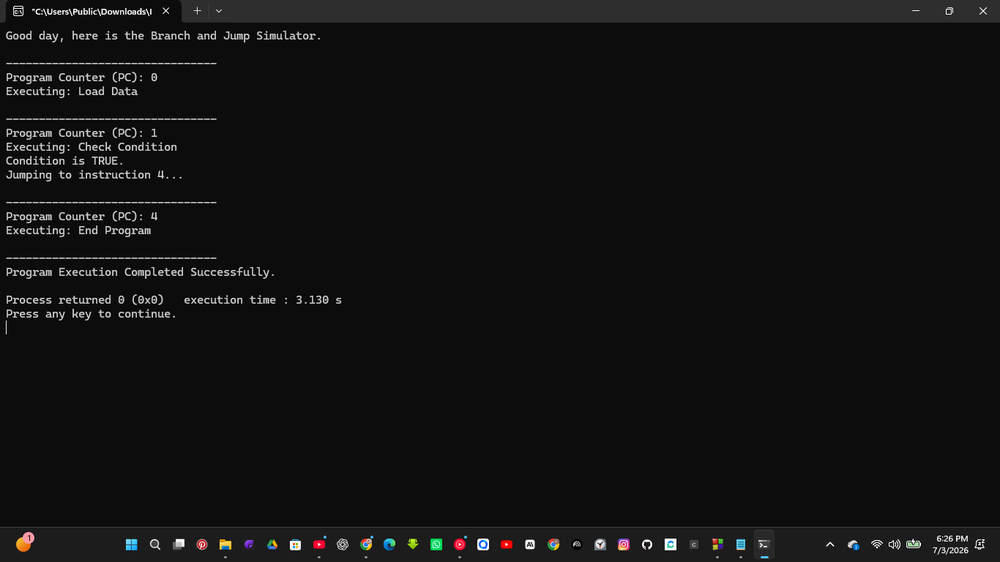

# Branch and Jump Simulator

## Overview

This project demonstrates how **branch** and **jump** instructions affect the flow of program execution inside a CPU. Unlike normal sequential execution where the processor moves from one instruction to the next, branch and jump instructions allow the CPU to skip instructions or continue execution from another location based on a condition.

In this simulation, I used an integer variable to represent the **Program Counter (PC)** and an array of instructions to simulate a simple program. An `if` statement is used to decide whether the Program Counter should continue normally or jump to another instruction.

---

## Project Objective

The objectives of this project are to:

* Simulate branch and jump instructions using C.
* Understand how the Program Counter controls program execution.
* Demonstrate how conditions affect the flow of a program.
* Relate C control statements such as `if` to CPU branching behavior.

---

## What are Branch and Jump Instructions?

During normal execution, the CPU processes instructions one after another.

```text
Instruction 0
      ↓
Instruction 1
      ↓
Instruction 2
      ↓
Instruction 3
      ↓
Instruction 4
```

However, when a branch or jump instruction is executed, the Program Counter changes its value and execution continues from another instruction instead of the next one.

For example:

```text
Instruction 0
      ↓
Instruction 1
      │
      └──────────────► Instruction 4
```

In this project, the Program Counter jumps directly from **Instruction 1** to **Instruction 4**, skipping the instructions in between.

---
## Project code file

[Click here to download the project file](code)

## Project output images




## Instructions Used

The simulated CPU executes the following instructions:

* Load Data
* Check Condition
* Add Numbers
* Store Result
* End Program

These instructions are stored in an array and executed according to the value of the Program Counter.

---

## How the Program Works

The program begins by creating a list of instructions and initializing the Program Counter to **0**.

A variable named **condition** is also created and assigned a value of **1**, representing a true condition.

The program then enters a loop where it:

1. Displays the current Program Counter value.
2. Displays the instruction currently being executed.
3. Checks whether the current instruction is **Check Condition**.
4. If the condition is true, the Program Counter jumps directly to **Instruction 4**.
5. If the condition is false, the Program Counter simply moves to the next instruction.
6. The process continues until all required instructions have been executed.

This demonstrates how branch and jump instructions change the normal execution flow of a program.

---

## Program Flow

```text
Start
   │
   ▼
Create Instruction List
   │
   ▼
Initialize Program Counter (PC = 0)
   │
   ▼
Display Current Instruction
   │
   ▼
Check Branch Condition
   │
   ├───────────────┐
   │               │
Condition False    Condition True
   │               │
   ▼               ▼
PC = PC + 1     PC = 4 (Jump)
   │               │
   └───────┬───────┘
           │
           ▼
Continue Execution
           │
           ▼
More Instructions?
           │
      Yes──┴──No
           │
           ▼
Program Completed
           │
           ▼
End
```

---

## Sample Output

```text
Good day, here is the Branch and Jump Simulator.

--------------------------------
Program Counter (PC): 0
Executing: Load Data

--------------------------------
Program Counter (PC): 1
Executing: Check Condition

Condition is TRUE.
Jumping to instruction 4...

--------------------------------
Program Counter (PC): 4
Executing: End Program

--------------------------------
Program Execution Completed Successfully.
```

---

## Project Demo video

[Click here to check out the project video](video/branch_and_jump_simulator_objective_video.mp4)


## What I Learned

This project helped me understand that the CPU does not always execute instructions in sequential order.

While building this simulator, I learned that:

* The **Program Counter (PC)** controls which instruction is executed next.
* Branch instructions depend on a condition before deciding where execution should continue.
* Jump instructions change the value of the Program Counter, allowing the processor to skip instructions.
* C control statements such as `if` simulate the same decision-making process performed by a processor during execution.

Although this is a software simulation, it helped me better understand how processors change execution flow and why branching is an important part of programming and computer architecture.

---

## Concepts Covered

* Program Counter (PC)
* Branch Instructions
* Jump Instructions
* Conditional Execution
* Control Flow
* Arrays
* Loops
* `if` Statements
* Computer Architecture Fundamentals

---

## Possible Improvements

Some future improvements for this project include:

* Supporting multiple branch conditions.
* Implementing a `switch` statement for different instruction types.
* Adding loop instructions.
* Simulating function calls using the Link Register (LR).
* Including additional CPU registers such as the Stack Pointer (SP) and Program Status Register (PSR).
* Building a more complete CPU instruction simulator.

---

## Technologies Used

* **Programming Language:** C
* **Compiler:** GCC
* **Concepts Covered:**

  * Branching
  * Jump Instructions
  * Program Counter
  * Conditional Statements
  * Computer Architecture

---

## Conclusion

This project demonstrates how branch and jump instructions influence the execution of a program by changing the value of the Program Counter. Instead of always moving to the next instruction, the processor can make decisions based on conditions and continue execution from another location. This project strengthened my understanding of CPU control flow and provided a practical introduction to how processors handle conditional execution.
